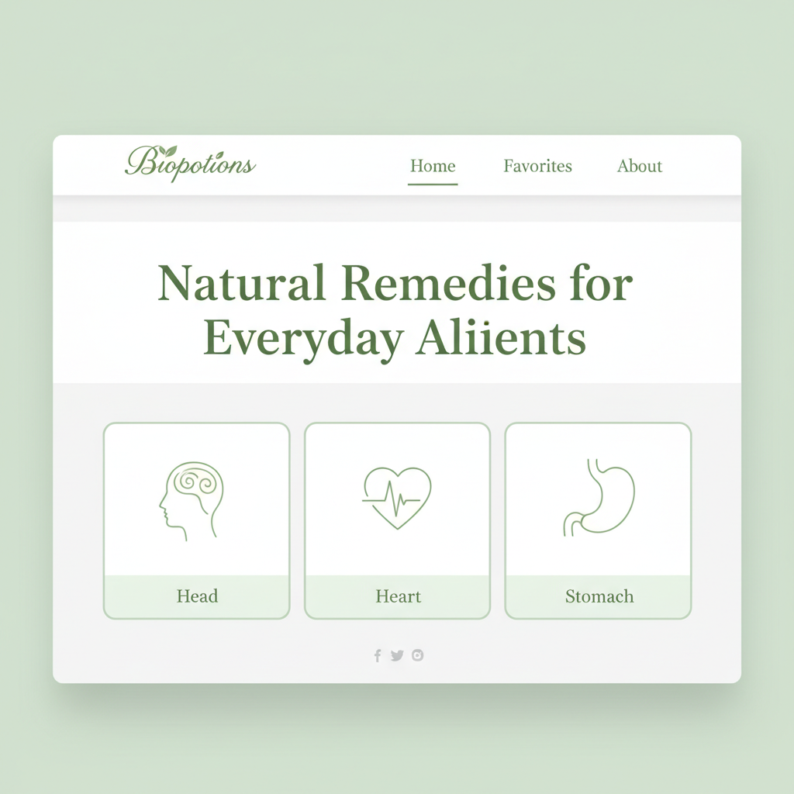

# Biopotions 🌿

> **Natural Remedies for Everyday Ailments**

Biopotions is a modern, single-page application (SPA) dedicated to rediscovering the healing power of nature. It provides a curated collection of natural home remedies for common ailments, organized by body part.

This project now features a **MERN stack integration** with a robust **offline fallback mechanism**.



## ✨ Features

*   **🔄 Hybrid Data Fetching**: Attempts to fetch data from the live backend API, but seamlessly falls back to local data if the server is unreachable.
*   **📊 Live Data Indicator**: Visual indicator in the UI showing whether you are using "Backend Data" or "Local Fallback".
*   **🔍 Smart Search**: Instantly find remedies by searching for body parts or specific ailments (works with both data sources).
*   **🌍 Multi-language Support**: Fully localized in **English**, **Spanish**, and **French**.
*   **❤️ Favorites System**: Save your most-used remedies for quick access (persisted locally).
*   **📱 Responsive Design**: A beautiful, mobile-first interface that works perfectly on all devices.

## 🛠️ Tech Stack

*   **Frontend**: React (v18), Tailwind CSS, Framer Motion
*   **Backend**: Node.js, Express, MongoDB
*   **Database**: MongoDB (with Mongoose)

## 🚀 Getting Started

### Prerequisites

*   Node.js (v14 or higher)
*   MongoDB (installed and running locally)

### Installation

1.  **Clone the repository**
    ```bash
    git clone https://github.com/yourusername/biopotions.git
    cd biopotions
    ```

2.  **Setup Backend**
    ```bash
    cd server
    npm install
    # Seed the database with initial data
    npm run seed
    ```

3.  **Setup Frontend**
    ```bash
    cd ../client
    npm install
    ```

### Running the Project

You can run the project in two modes to test the fallback mechanism.

#### Mode A: Full Stack (Backend + Frontend)
1.  **Start MongoDB** (ensure your local mongo service is running).
2.  **Start the Server**:
    ```bash
    # In /server directory
    npm start
    ```
    (Server runs on port 5000)
3.  **Start the Client**:
    ```bash
    # In /client directory
    npm start
    ```
    (Client runs on port 3000)

**Result**: The UI indicator on the top right will show **"Using backend data"** (Green).

#### Mode B: Frontend Only (Fallback Mode)
1.  **Stop the Server** (Ctrl+C in the server terminal).
2.  **Refresh the Client**.

**Result**: The UI indicator will show **"Using local JSON fallback"** (Yellow). The app remains fully functional using the bundled data file.

### 🔧 Configuration

You can force the application to run in **Frontend-Only Mode** (skipping the backend connection attempt entirely) by editing `client/src/config.js`:

```javascript
// client/src/config.js
export const ENABLE_BACKEND = false; // Set to false to hide the indicator and use local data only
```

This removes the connection delay when the backend is offline and hides the status indicator.

## 🧪 Testing the Fallback

1.  Start both client and server.
2.  Verify the green "Using backend data" badge appears.
3.  Kill the server process.
4.  Refresh the page (or navigate around).
5.  Verify the badge changes to yellow "Using local JSON fallback".
6.  Try searching and navigating; everything should still work!

## 📂 Project Structure

*   `/client`: React frontend application.
    *   `/src/data.js`: Local fallback dataset.
    *   `/src/hooks/useDataFetcher.js`: Logic for handling the fetch-or-fallback strategy.
*   `/server`: Express backend API.
    *   `/models`: Mongoose schemas (BodyPart).
    *   `/seed.js`: Script to populate MongoDB with multilingual data.

## 📄 License

This project is licensed under the MIT License - see the [LICENSE](LICENSE) file for details.

---
*Created with 💚 by [Your Name]*
