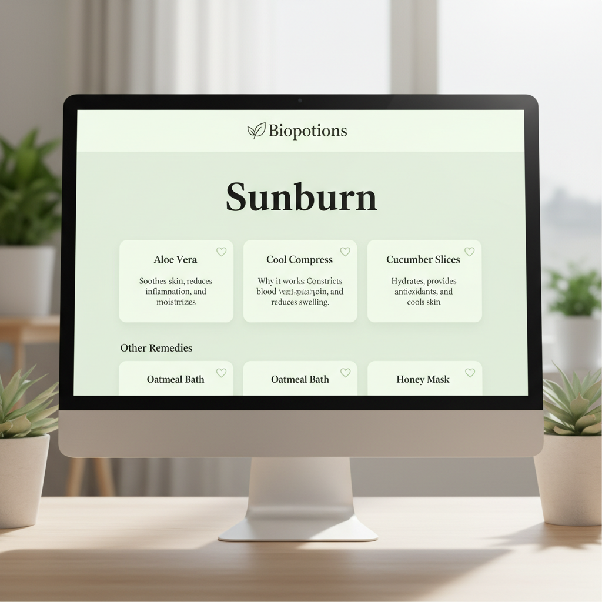

# Biopotions 🌿

> **Natural Remedies for Everyday Ailments**

Biopotions is a modern, single-page application (SPA) dedicated to rediscovering the healing power of nature. It provides a curated collection of natural home remedies for common ailments, organized by body part.


## ✨ Features

*   **🔍 Smart Search**: Instantly find remedies by searching for body parts or specific ailments.
*   **🌍 Multi-language Support**: Fully localized in **English**, **Spanish**, and **French**.
*   **❤️ Favorites System**: Save your most-used remedies for quick access (persisted locally).
*   **📱 Responsive Design**: A beautiful, mobile-first interface that works perfectly on all devices.
*   **🎨 Modern UI**: Minimalistic, nature-inspired aesthetic with smooth transitions and intuitive navigation.
*   **⚡ Fast & Lightweight**: Built as a static frontend application for optimal performance.

## 🛠️ Tech Stack

*   **Frontend**: [React](https://reactjs.org/) (v18)
*   **Styling**: [Tailwind CSS](https://tailwindcss.com/)
*   **Routing**: [React Router](https://reactrouter.com/)
*   **Icons**: [Lucide React](https://lucide.dev/)
*   **Animations**: [Framer Motion](https://www.framer.com/motion/)
*   **SEO**: [React Helmet Async](https://github.com/staylor/react-helmet-async)
*   **State Management**: React Context API (for Language) & LocalStorage (for Favorites)

## 🚀 Getting Started

### Prerequisites

*   Node.js (v14 or higher)
*   npm or yarn

### Installation

1.  **Clone the repository**
    ```bash
    git clone https://github.com/yourusername/biopotions.git
    cd biopotions
    ```

2.  **Install dependencies**
    ```bash
    cd client
    npm install
    ```

3.  **Start the development server**
    ```bash
    npm start
    ```
    The app will open at `http://localhost:3000`.

## 📸 Screenshots

| Home Page | Ailment Details |
|:---:|:---:|
|  |  |

## 🌐 Deployment

This project is optimized for deployment on **Netlify**, **Vercel**, or any static site host.

**Build for production:**
```bash
npm run build
```
The output will be in the `build` folder, ready to be deployed.

## 📄 License

This project is licensed under the MIT License - see the [LICENSE](LICENSE) file for details.

---
*Created with 💚 by [Your Name]*
